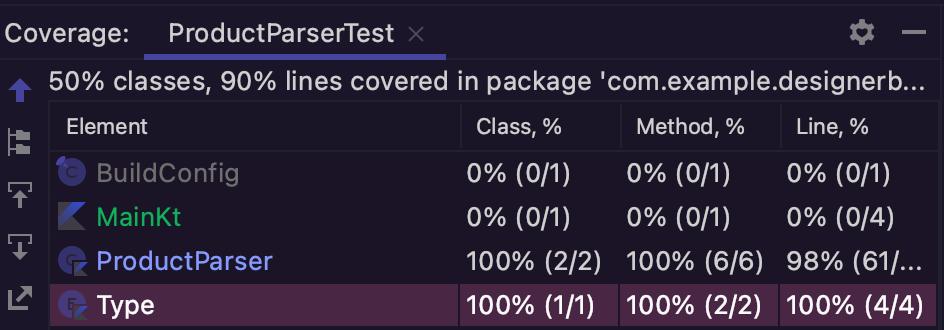

# Jeff-Bailey-work-sample

## Description
This is the Solution to https://github.com/designer-brands/digital-work-sample. 
This was coded in Kotlin. The goal was to create a file that would generate a report based off of data in the format of data.txt i.e.
```Type,normal,Normal Price  
Type,clearance,Clearance Price
Type,price_in_cart,Price In Cart
Product,59.99,39.98,10,false
Product,49.99,49.99,8,false
Product,79.99,49.98,5,false
```
to output a result that sorts the clearance price, normal price, and price in cart based off of products from data.txt file like the sample below: 

```
Clearance Price: 2 products @ $39.98-$49.98
Normal Price: 1 product @ $49.99
Price In Cart: 0 products
```
## Solution
When I encounter a problem I like to first read through it and then work in reverse. So I see the end result that I want. I could see that we want clearance price, normal price, and price in cart all separated in order. Also that I noticed that I will have to do some formatting with the special characters. Then After that I took a look at the data.txt file and also noticed the different price between normal and clearance prices so I realized I would have to use a comparing operator sometime as well. 

Then I started off by adding the data.txt file to the initial project and then created a file "ProductParser". 

I then I created a file Main.kt to get the reference to the data.txt file and the ProductParser file. 

Next I needed to be able to read the file and the parse the contents. I then created a Type file to separate the Clearance, Normal, and price in cart. After that I used a forEachLine to specify what I want the file to traverse the data and while doing so to udpate the resultMap. That was then thrown in a try-catch-finally block to cover some error handling. 

After that I created an extentsion function that updates the map based on the clearance Price it is provided. depending on wether the clearance price is the same as normal price or it has a clearance.  Then I used this[key] to apply the finally apply the updates. Using the extension function seemed like the best course of action since using that sures the data I want to manipulate is the correct data.

Next I created another extension function that will iterate through the map. Then it will format and print each item in the map based on the information that was achieved from the above funtions. I used StringBuilder() for this because it seemed like the best way to achieve this since it allows me to modify strings. From there a formatted it the way the solution called for. 
## Results


Finally I implemented a unit Test. I added a test to see for if it would fail and if it would be successful.
## Results of Tests



